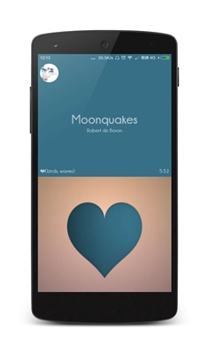
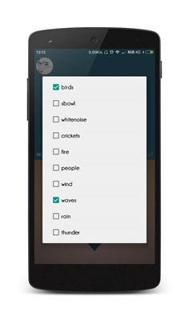
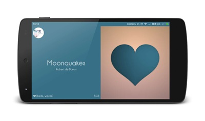

# Murmur

Murmur 是一个添加了 [白噪声](https://zh.wikipedia.org/wiki/%E7%99%BD%E9%9B%9C%E8%A8%8A) 效果的第三方豆瓣电台 Android 客户端。它使用 **[Kotgo](https://github.com/)** 进行构建，并应用了 MVP 设计模式。它的主体代码使用 Kotin 进行编写。

## 屏幕截图
  

## 程式主体
你可以在 [这里](https://github.com/nekocode/murmur/releases/download/0.2.0/Murmur.apk) 下载到它。

## 免责声明
该项目仅限用于学术研究，不得用于商业用途。
